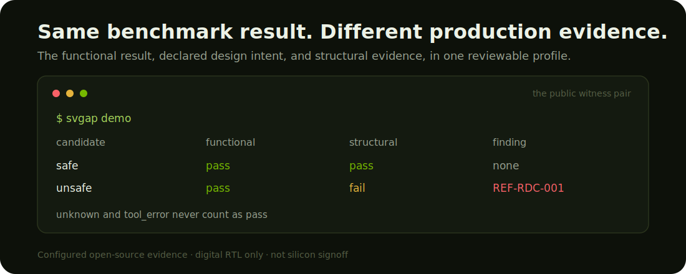

# SV-Gap

[](https://github.com/shsridhar-beep/svgap/actions/workflows/ci.yml)
[](https://shsridhar-beep.github.io/svgap/)
[](https://pypi.org/project/svgap/)
[](https://doi.org/10.5281/zenodo.21199886)
[](LICENSE)

**Make the gap between “passes the benchmark” and “reviewable by a chip-design
team” explicit.**

SV-Gap is an open evaluation layer for AI-generated digital RTL. It preserves
the functional result produced by a research workflow, adds declared clock and
reset intent plus structural evidence, and reports which configured production
questions are answered, failed, or still unknown.

> Supply RTL and evaluation evidence. SV-Gap tells you what that evidence
> establishes, what it contradicts, what remains unresolved, and what evidence
> would reduce the uncertainty.

SV-Gap begins with clock-domain crossing (CDC) and reset-domain crossing (RDC).
It is early research software, not a replacement for commercial signoff.



## Who this is for

| You are… | Use SV-Gap to… | Opportunities to build |
|---|---|---|
| A frontier-model researcher | Test whether models produce evidence-complete RTL, diagnose missing evidence, and repair structural findings without regression | Model baselines, agent policies, diagnosis methods, repair methods |
| An RTL benchmark maintainer | Learn whether tasks carry enough clock/reset intent to evaluate production-oriented properties | Benchmark adapters, intent-bearing contracts, result submissions |
| A chip-design AI builder | Add a structural evidence gate after generation and functional testing | Pipeline integrations, CI adapters, evidence dashboards |
| An RTL or verification engineer | Make the reason a functionally passing candidate is blocked explicit | Minimal counterexamples, disputed findings, independent evidence |
| An EDA researcher or tool author | Compare structural backends under a shared evidence contract | Open checker backends, differential studies, digital RTL taskpacks |
| An evaluation researcher | Study when offline success does not identify deployment validity | Abstention semantics, construct-validity studies, cross-domain methods |

## See the gap in two minutes

Install Python 3.11+, Yosys, and Icarus Verilog. On macOS:

```bash
brew install yosys icarus-verilog
python3 -m venv .venv
.venv/bin/python -m pip install svgap==0.3.0a2
.venv/bin/svgap demo
```

The demo produces one functional result and two different structural outcomes:

```text
candidate  functional  structural  findings
safe       pass        pass        none
unsafe     pass        fail        REF-RDC-001
```

Both implementations satisfy the supplied functional test. Declared
reset-release intent separates them structurally. Preserve the complete
reproducer with `svgap demo --output demo-output`.

For a copy-pasteable machine-readable check, keep the generated artifacts out
of Git and inspect the JSON summary:

```bash
svgap demo --json --output demo-output \
  | jq '{status, safe: .safe.structural, unsafe: .unsafe.structural, findings: .unsafe.findings}'
```

```json
{
  "findings": [
    "REF-RDC-001"
  ],
  "safe": "pass",
  "status": "pass",
  "unsafe": "fail"
}
```

Attach `demo-output/summary.json`, both `*/build/report.json` files, and the
preserved manifests/RTL sources to an issue or CI artifact when sharing a
reproduction. The demo is a controlled witness that the supplied functional
oracle does not identify the structural reset-release finding; it is not a
defect-rate estimate or silicon signoff.

The same workflow is available in the open-tool container:

```bash
docker run --rm ghcr.io/shsridhar-beep/svgap:v0.3.0-alpha.2 demo
```

## Use SV-Gap on your own RTL

```bash
svgap init path/to/design.sv \
  --top top \
  --candidate-id experiment-001 \
  --output path/to/manifest.toml

svgap validate path/to/manifest.toml
svgap check path/to/manifest.toml
svgap explain path/to/build/report.json
```

`init` deliberately does not guess intent. `validate` exposes missing functional,
clock, reset, and relationship evidence before execution. `explain` translates
the resulting report into answered, failed, and unanswered questions.

Follow the complete [bring-your-own-RTL tutorial](docs/bring-your-own-rtl.md),
including an executable manifest and imported-result path.

## Research with SV-Gap

### Generation

Ask whether a model can produce RTL with passing and determinate functional and
structural evidence—not merely code that passes a testbench.

### Diagnosis

Ask whether a model distinguishes evidence that establishes a property,
evidence that contradicts it, and a question that remains unresolved.

### Repair

Ask whether a model removes a structural finding while preserving functional
acceptance, checker coverage, candidate identity, and freedom from new rule
regressions.

The public [`challenges/v0.1`](challenges/v0.1/) contract defines all three
tracks. Profiles remain multidimensional rather than hiding failure modes in a
single score. See the [baseline registry](results/README.md) to reproduce or
submit a result.

To run any model you control — an internal checkpoint, an API endpoint, or a
local runtime — through a full taskpack with no provider CLI, follow
[evaluate your model](docs/evaluate-your-model.md): your generator reads a
prompt on stdin and prints a response; the harness does the rest.

## Current evidence

- Four controlled safe/unsafe CDC/RDC witness pairs pass the same functional
  tests and are separated by declared structural rules.
- A frozen 72-call reset-release study contains 57 functional passes; at least
  14 contain the declared raw-reset pattern.
- A heuristic inventory covers 508 public RTL-generation tasks across
  VerilogEval, RTLLM, and CVDP.
- A small exploratory frontier-model baseline exposes a crossed failure mode:
  one configuration preserves epistemic uncertainty but misses the repair;
  another repairs the configured finding but overstates what the diagnosis
  evidence establishes.

These are an executable existence result, a taskpack-conditional demonstration,
and a heuristic inventory. They are not a population defect estimate or a model
ranking.

[Controlled result](docs/controlled-result.md) ·
[Reset result](docs/reset-replication-result.md) ·
[Benchmark audit](docs/benchmark-audit.md) ·
[Compact research note](docs/compact-research-note.md)

## Build with us

SV-Gap is shared research infrastructure. You do not need to agree with the
reference checker to contribute.

### Add a taskpack

Create public digital RTL tasks with explicit clock/reset intent, executable
functional evidence, and calibrated references.

### Add a checker backend

Implement one operation:

```python
check(manifest) -> CheckResult
```

Backends preserve `pass`, `fail`, `unknown`, and `tool_error`. Missing intent or
unsupported syntax must never become a pass. See the
[backend SDK](docs/backend-sdk.md).

### Add a benchmark adapter

Import an existing benchmark’s functional result while binding it
cryptographically to the evaluated RTL.

### Contribute model evidence

Submit generation, diagnosis, or repair results using the public registry
contract. Negative results, abstentions, and disagreements are welcome.

### Challenge the oracle

Contribute a minimal false positive, false negative, competing backend result,
or expert adjudication. Disagreement is evidence, not a project failure.

[Good first issues](https://github.com/shsridhar-beep/svgap/issues?q=is%3Aissue+is%3Aopen+label%3A%22good+first+issue%22) ·
[Contribution guide](CONTRIBUTING.md) ·
[Discussions](https://github.com/shsridhar-beep/svgap/discussions) ·
[Roadmap](ROADMAP.md)

## High-value open research problems

1. Which production-oriented properties are absent from current RTL benchmarks?
2. Can models recognize missing intent instead of inventing it?
3. Does structural feedback improve repair without creating functional regressions?
4. How stable are results across independent open checker backends?
5. What evidence package makes generated RTL reviewable downstream?
6. How should multidimensional evidence be compared without hiding unknown states?

## Scope and limitations

SV-Gap covers digital RTL and digital verification. See the explicit
[scope boundary](docs/scope-boundary.md).

The built-in Yosys backend is deliberately narrow and is not signoff-grade. A
structural pass means only that the configured backend emitted no failing
finding within its declared coverage. It is not proof of silicon safety.

The generic trace-adjudication scaffold uses prerecorded fixtures. The real
reset-release perturbation instrumenter remains unimplemented pending patent
and employer review.

See [methodology](docs/methodology.md), [architecture](docs/architecture.md), and
[limitations](docs/limitations.md) before interpreting claim-bearing results.

## Install and integrate

### From PyPI

```bash
python3 -m pip install svgap==0.3.0a2
svgap doctor
```

### From source

```bash
git clone https://github.com/shsridhar-beep/svgap
cd svgap
python3 -m venv .venv
.venv/bin/python -m pip install -e .
.venv/bin/svgap doctor
```

### GitHub Actions

Use the reusable action in [`.github/actions/svgap`](.github/actions/svgap) to
attach normalized structural evidence to an existing RTL pipeline.

### Requirements

- Python 3.11–3.13
- Yosys and Icarus Verilog for the built-in backend
- Only open-source tools are assumed by default

## Community and citation

Ask integration questions and propose research directions in
[GitHub Discussions](https://github.com/shsridhar-beep/svgap/discussions). Use
the issue templates for reproducible bugs, taskpacks, backends, and false
results. See [GOVERNANCE.md](GOVERNANCE.md), [SECURITY.md](SECURITY.md), and
[SUPPORT.md](SUPPORT.md).

Cite the exact GitHub release used. The independently fetched and scanned
archive for `v0.3.0-alpha.2` is available at
[doi:10.5281/zenodo.21199886](https://doi.org/10.5281/zenodo.21199886).

Apache-2.0. External tools and imported datasets retain their own licenses.
